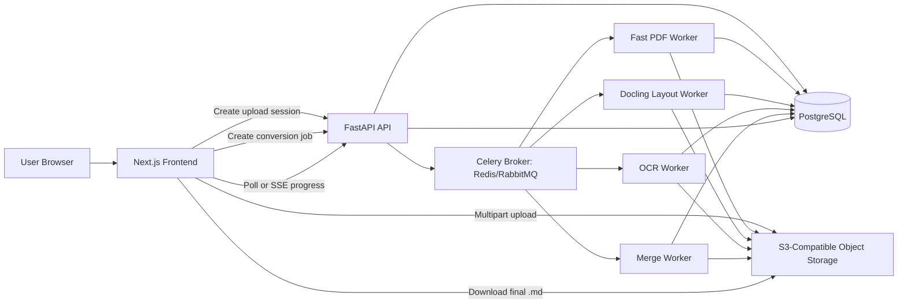
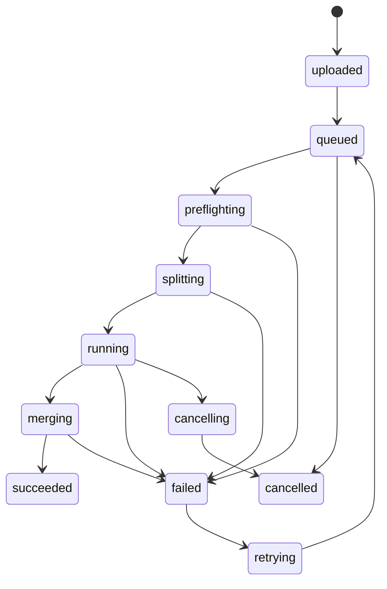

# PDF and PowerPoint to Markdown Web App Specification

**Version:** 1.0  
**Date:** 2026-06-08  
**Status:** Recommended production baseline  
**Primary goal:** Build a stable web app that converts PDF and PowerPoint files into Markdown files, with large documents split into asynchronous conversion batches for smooth UX and reliable processing.

---

## 1. Product Scope

### 1.1 Core User Flow

1. User uploads a `.pdf`, `.pptx`, or optionally `.ppt` file.
2. App validates file type, size, checksum, and conversion limits.
3. App creates a conversion job and stores the original file in object storage.
4. App runs a preflight step to inspect the file:
   - File type
   - Page count or slide count
   - Text layer quality
   - Whether OCR is likely needed
   - Approximate complexity
5. App splits large files into batches.
6. Worker processes convert batches asynchronously.
7. App tracks progress and shows job status to the user.
8. App merges all batch outputs into one final `.md` file.
9. User downloads the final Markdown file and optional extracted assets.

### 1.2 Functional Requirements

| ID | Requirement | Priority |
|---|---|---:|
| FR-001 | Upload PDF and PPTX files | Must |
| FR-002 | Convert uploaded files to Markdown | Must |
| FR-003 | Split large PDFs by page ranges | Must |
| FR-004 | Run conversion batches asynchronously | Must |
| FR-005 | Show progress, status, and errors | Must |
| FR-006 | Merge batch outputs in deterministic order | Must |
| FR-007 | Preserve headings, paragraphs, lists, tables, and image references where possible | Must |
| FR-008 | Extract images into an `assets/` folder when enabled | Should |
| FR-009 | Support OCR for scanned PDFs | Should |
| FR-010 | Allow retrying failed batches | Should |
| FR-011 | Allow cancelling jobs | Should |
| FR-012 | Support `.ppt` through LibreOffice fallback conversion | Could |
| FR-013 | Optional cloud fallback for very difficult scanned documents | Could |

### 1.3 Non-Goals

This app is not intended to be a pixel-perfect document renderer. Markdown output should be readable, structured, and useful for humans, search, documentation workflows, and AI/RAG pipelines. Exact slide positioning, advanced animations, embedded media playback, and complex vector fidelity are out of scope for the first version.

---

## 2. Recommended Stable Tech Stack

### 2.1 Final Recommendation

| Layer | Recommended Technology | Reason |
|---|---|---|
| Frontend | Next.js 16, React, TypeScript | Stable modern web UI, strong file upload UX, server-rendered pages where useful, easy deployment. |
| Upload UI | Uppy or custom S3 multipart upload flow | Handles large file uploads, retries, progress, and resumability. |
| API | FastAPI | Python-native API layer that fits the Python document conversion ecosystem. |
| Async Jobs | Celery 5.6 | Mature distributed task queue with stable Redis and RabbitMQ broker support. |
| Broker | Redis for MVP; RabbitMQ for stricter production messaging | Redis is simple and fast for small messages; RabbitMQ is stronger for broker durability and larger message patterns. |
| Database | PostgreSQL | Durable source of truth for jobs, batches, users, files, outputs, and error states. |
| Object Storage | S3-compatible storage: AWS S3, Cloudflare R2, MinIO, or GCS S3 gateway | Stores original files, temporary batch outputs, final Markdown, assets, and logs. |
| Primary Converter | Docling | Best overall local converter for PDF/PPTX to structured output and Markdown. |
| PDF Fast Path | PyMuPDF4LLM | Fast PDF-to-Markdown for clean digital PDFs. |
| Simple/Fallback Converter | Microsoft MarkItDown | Lightweight fallback for simple PPTX/PDF to Markdown where high fidelity is not required. |
| Utility Converter | LibreOffice headless | Useful fallback for rendering PPT/PPTX to PDF or images, not primary Markdown conversion. |
| Deployment | Docker containers | Isolates untrusted file conversion and makes workers independently scalable. |
| Monitoring | Sentry, OpenTelemetry, Prometheus/Grafana, Flower for Celery | Error reporting, traces, metrics, queue visibility. |
| Auth | Clerk, Auth.js, Supabase Auth, or custom JWT | Use whichever fits the product. Auth is not central to the conversion architecture. |

### 2.2 Runtime Versions

Use these as the starting baseline:

```text
Frontend runtime: Node.js active LTS
Frontend framework: Next.js 16
Language: TypeScript
Backend runtime: Python 3.13, or Python 3.12 if a dependency requires it
API framework: FastAPI
Workers: Python 3.13/3.12 in separate Docker images
Database: PostgreSQL 16+
Broker: Redis 7+ for MVP, RabbitMQ 3.13+ for production-hardening
Object storage: S3-compatible API
```

### 2.3 Key Architectural Decision

Do **not** run file conversion inside the web request process.

The API should:

- Accept job creation requests
- Issue signed upload URLs
- Validate metadata
- Enqueue conversion jobs
- Return job status
- Serve final download links

The workers should:

- Download files from object storage
- Convert page/slide batches
- Write batch outputs
- Update batch/job state
- Merge final Markdown

---

## 3. System Architecture



### 3.1 Service Boundaries

| Service | Responsibility |
|---|---|
| `frontend` | Upload UI, progress UI, job list, result download page. |
| `api` | Auth, upload sessions, job creation, validation, status endpoints, signed result URLs. |
| `worker-fast` | Fast conversion for clean digital PDFs using PyMuPDF4LLM. |
| `worker-layout` | Default high-quality conversion using Docling. |
| `worker-ocr` | OCR-heavy conversion with lower concurrency and stricter memory limits. |
| `worker-merge` | Merge batch Markdown files, normalize output, write final result. |
| `postgres` | Durable application state. |
| `redis` or `rabbitmq` | Task broker only; do not use it as the only source of job truth. |
| `object-storage` | Original files, intermediate files, final Markdown, assets, and optional logs. |

---

## 4. Conversion Engine Strategy

### 4.1 Default Routing

| Input | Condition | Primary Route | Fallback Route |
|---|---|---|---|
| PDF | Clean digital text layer, simple layout | PyMuPDF4LLM | Docling |
| PDF | Complex layout, tables, multi-column, figures | Docling | PyMuPDF4LLM partial extraction or cloud fallback |
| PDF | Scanned or mostly image-based | Docling with OCR | Cloud document intelligence fallback |
| PPTX | Normal presentation | Docling | MarkItDown |
| PPTX | Direct conversion fails | MarkItDown | LibreOffice render to PDF/images, then Docling/PyMuPDF4LLM |
| PPT | Legacy PowerPoint | LibreOffice convert to PPTX or PDF first | Mark as failed if conversion is unsafe or unsupported |

### 4.2 Primary Converter: Docling

Use Docling as the default conversion engine because it supports document conversion across PDF, DOCX, PPTX, images, HTML, Markdown, and other formats, and exposes a `DocumentConverter` API with single-document and batch-conversion capabilities.

Recommended use:

```python
from docling.document_converter import DocumentConverter

converter = DocumentConverter()
result = converter.convert("input.pdf")
markdown = result.document.export_to_markdown()
```

For large PDFs, use page-range processing where supported by the converter pipeline. Store each page-range output separately and merge later.

Recommended Docling role:

- Default PDF converter
- Default PPTX converter
- OCR-enabled route for scanned PDFs
- Better layout/table route for complex files
- Structured JSON route if later you need richer downstream processing

### 4.3 PDF Fast Path: PyMuPDF4LLM

Use PyMuPDF4LLM for clean digital PDFs where speed and simplicity matter.

Recommended use:

```python
import pymupdf4llm

markdown = pymupdf4llm.to_markdown("input.pdf")
```

Recommended role:

- Fast path for text-based PDFs
- Per-page chunk extraction
- Lower-resource conversion for simple files
- Fallback when Docling fails on a simple file

Important licensing note:

- PyMuPDF4LLM is dual licensed under GNU AGPL 3.0 or an Artifex commercial license. Review licensing before using it in a closed-source or hosted commercial product.

### 4.4 Simple Fallback: Microsoft MarkItDown

Use MarkItDown as a fallback for simple PPTX/PDF conversions and LLM-ready Markdown. It is useful, but it should not be the only production converter if the output must be high fidelity.

Recommended use:

```python
from markitdown import MarkItDown

md = MarkItDown()
result = md.convert("deck.pptx")
markdown = result.text_content
```

Recommended role:

- PPTX fallback
- Simple PDF fallback
- Quick extraction where structure is more important than visual fidelity

Security note:

- Run MarkItDown only inside restricted worker containers because it performs I/O using the privileges of the current process.

### 4.5 Utility Fallback: LibreOffice Headless

LibreOffice headless should not be the primary Markdown converter. Use it only when you need to:

- Convert legacy `.ppt` to `.pptx` or `.pdf`
- Render slides to images
- Produce a PDF fallback from a deck before running PDF conversion
- Generate visual slide previews

Example worker-side command pattern:

```bash
soffice --headless --convert-to pdf --outdir /tmp/out /tmp/input.pptx
```

Run LibreOffice in a locked-down worker container with temporary directories, timeouts, and no host filesystem access.

### 4.6 Optional Cloud Fallback

Cloud document AI services are optional and should be used only for difficult documents where local conversion fails or quality is unacceptable.

Possible cloud fallback options:

- Azure Document Intelligence Layout
- Google Document AI
- AWS Textract
- LlamaParse

Use cloud fallback only when the product accepts:

- External data processing
- API cost
- Latency
- Vendor lock-in
- Cloud provider privacy terms

---

## 5. Models Needed

This app does **not** require a general-purpose LLM for the base conversion workflow.

### 5.1 Required Models and Engines

| Model/Engine | Required? | Used By | Purpose |
|---|---:|---|---|
| Docling layout model family | Yes, through Docling | Docling workers | Detect document structure such as paragraphs, tables, figures, headers, and layout blocks. |
| Docling table-structure models | Yes, through Docling | Docling workers | Recover table rows, columns, and cells for Markdown table output. |
| OCR engine | Recommended | Docling/PyMuPDF4LLM OCR route | Extract text from scanned pages or image-only content. |
| Tesseract OCR | Recommended baseline OCR | Docling, PyMuPDF4LLM | Stable local OCR engine. Good default for English and common languages. |
| EasyOCR or RapidOCR | Optional | Docling OCR route | Alternative OCR engines; useful for language or accuracy experiments. |
| Granite Docling / VLM models | Optional | Advanced Docling route | Higher-end document understanding if quality justifies extra resource cost. |
| Cloud layout/OCR model | Optional fallback | Cloud fallback route | Difficult scanned files, handwriting, poor scans, complex tables. |
| General LLM | Not required | Optional post-processing only | Cleanup, summarization, metadata extraction, or quality scoring. |

### 5.2 Model Storage and Loading

Worker images should either:

1. Pre-download required Docling/OCR models during Docker image build, or
2. Mount a persistent model cache volume.

Do not download large models repeatedly during user requests.

Recommended worker model cache paths:

```text
/app/.cache/docling
/app/.cache/huggingface
/app/.cache/easyocr
/usr/share/tesseract-ocr/5/tessdata
```

### 5.3 OCR Language Packs

Start with:

```text
eng   English
swe   Swedish, if Swedish documents are expected
osd   Orientation and script detection
```

Add more language packs only when needed because OCR memory and runtime can grow with language complexity.

### 5.4 When to Use an LLM

LLMs should be optional and isolated from the core conversion path.

Acceptable optional LLM features:

- Clean malformed Markdown headings
- Generate document summaries
- Extract metadata from the converted Markdown
- Classify document type
- Score conversion quality
- Create table-of-contents suggestions

Do not require an LLM to convert PDFs/PPTX to Markdown. Local deterministic conversion is more stable, cheaper, and easier to reason about.

---

## 6. Asynchronous Workflow

### 6.1 Job Lifecycle



### 6.2 Detailed Workflow

#### Step 1: Create Upload Session

API endpoint:

```http
POST /api/uploads
```

Input:

```json
{
  "filename": "deck.pdf",
  "content_type": "application/pdf",
  "size_bytes": 157286400
}
```

Output:

```json
{
  "file_id": "file_123",
  "upload_mode": "multipart",
  "upload_urls": ["..."],
  "storage_key": "uploads/user_1/file_123/original.pdf"
}
```

Large files should use multipart upload. As a rule of thumb, switch to multipart upload at 100 MB or lower.

#### Step 2: Complete Upload

API endpoint:

```http
POST /api/uploads/{file_id}/complete
```

Actions:

- Verify object exists in storage.
- Verify size.
- Store checksum if available.
- Persist file metadata.

#### Step 3: Create Conversion Job

API endpoint:

```http
POST /api/conversions
```

Input:

```json
{
  "file_id": "file_123",
  "output_format": "markdown",
  "options": {
    "extract_images": true,
    "ocr": "auto",
    "preserve_page_breaks": true,
    "preferred_converter": "auto"
  }
}
```

Output:

```json
{
  "job_id": "job_123",
  "status": "queued"
}
```

#### Step 4: Preflight Job

Worker task:

```text
preflight_document(job_id)
```

Actions:

- Download file from object storage.
- Verify MIME type by content, not only filename.
- Detect PDF page count or PPTX slide count.
- Estimate whether OCR is needed.
- Select converter route.
- Determine batch size.
- Create `conversion_batches` rows.

#### Step 5: Split Into Batches

Recommended starting batch sizes:

| Document Type | Condition | Batch Size |
|---|---|---:|
| PDF | Clean digital text | 20-50 pages |
| PDF | Complex layout/tables | 10-25 pages |
| PDF | OCR-heavy/scanned | 2-10 pages |
| PPTX | Normal deck | 25-50 slides |
| PPTX | Heavy images/charts | 10-25 slides |

Batch size should be configurable per worker queue.

#### Step 6: Fan Out Batch Tasks

Worker task:

```text
convert_batch(job_id, batch_id, start_unit, end_unit, converter_route)
```

Actions:

- Acquire a batch lock.
- Download original file or use cached local copy if safe.
- Convert only the assigned page/slide range.
- Write batch Markdown to object storage.
- Write extracted assets to batch-specific asset prefix.
- Update batch status.

Batch output path pattern:

```text
jobs/{job_id}/batches/{batch_index}/part.md
jobs/{job_id}/batches/{batch_index}/assets/
```

#### Step 7: Merge Outputs

Worker task:

```text
merge_job_outputs(job_id)
```

Actions:

- Verify all batches succeeded.
- Sort batches by `batch_index`.
- Merge Markdown.
- Rewrite asset links.
- Add YAML front matter.
- Normalize page/slide separators.
- Write final output.

Final output path pattern:

```text
jobs/{job_id}/final/document.md
jobs/{job_id}/final/assets/
jobs/{job_id}/final/document.zip
```

#### Step 8: Progress Updates

Frontend options:

1. Polling: `GET /api/conversions/{job_id}` every 1-3 seconds.
2. Server-Sent Events: `GET /api/conversions/{job_id}/events`.

Use polling for the MVP. Use SSE when progress messages become more detailed.

---

## 7. API Specification

### 7.1 Endpoints

| Method | Endpoint | Purpose |
|---|---|---|
| `POST` | `/api/uploads` | Create upload session and signed upload URLs. |
| `POST` | `/api/uploads/{file_id}/complete` | Mark upload complete and verify object. |
| `POST` | `/api/conversions` | Create conversion job. |
| `GET` | `/api/conversions/{job_id}` | Fetch job status and progress. |
| `GET` | `/api/conversions/{job_id}/events` | Stream job events with SSE. |
| `POST` | `/api/conversions/{job_id}/cancel` | Cancel queued/running job. |
| `POST` | `/api/conversions/{job_id}/retry` | Retry failed job or failed batches. |
| `GET` | `/api/conversions/{job_id}/download` | Return signed download URL for final Markdown or ZIP. |
| `GET` | `/api/conversions` | List user's conversion jobs. |

### 7.2 Job Status Response

```json
{
  "job_id": "job_123",
  "status": "running",
  "file": {
    "filename": "deck.pdf",
    "content_type": "application/pdf",
    "size_bytes": 157286400
  },
  "progress": {
    "total_units": 120,
    "completed_units": 60,
    "percent": 50.0,
    "current_stage": "converting"
  },
  "batches": {
    "total": 8,
    "queued": 1,
    "running": 2,
    "succeeded": 5,
    "failed": 0
  },
  "result": null,
  "error": null,
  "created_at": "2026-06-08T10:00:00Z",
  "updated_at": "2026-06-08T10:03:00Z"
}
```

### 7.3 Final Download Response

```json
{
  "job_id": "job_123",
  "markdown_url": "https://signed-url/document.md",
  "zip_url": "https://signed-url/document.zip",
  "expires_at": "2026-06-08T11:00:00Z"
}
```

---

## 8. Database Model

### 8.1 Tables

#### `files`

```sql
CREATE TABLE files (
    id UUID PRIMARY KEY,
    user_id UUID NOT NULL,
    original_filename TEXT NOT NULL,
    storage_key TEXT NOT NULL,
    content_type TEXT NOT NULL,
    size_bytes BIGINT NOT NULL,
    sha256 TEXT,
    status TEXT NOT NULL DEFAULT 'uploaded',
    created_at TIMESTAMPTZ NOT NULL DEFAULT now(),
    updated_at TIMESTAMPTZ NOT NULL DEFAULT now()
);
```

#### `conversion_jobs`

```sql
CREATE TABLE conversion_jobs (
    id UUID PRIMARY KEY,
    file_id UUID NOT NULL REFERENCES files(id),
    user_id UUID NOT NULL,
    status TEXT NOT NULL,
    output_format TEXT NOT NULL DEFAULT 'markdown',
    converter_route TEXT,
    total_units INTEGER,
    completed_units INTEGER NOT NULL DEFAULT 0,
    batch_count INTEGER NOT NULL DEFAULT 0,
    options_json JSONB NOT NULL DEFAULT '{}'::jsonb,
    error_code TEXT,
    error_message TEXT,
    started_at TIMESTAMPTZ,
    finished_at TIMESTAMPTZ,
    created_at TIMESTAMPTZ NOT NULL DEFAULT now(),
    updated_at TIMESTAMPTZ NOT NULL DEFAULT now()
);
```

#### `conversion_batches`

```sql
CREATE TABLE conversion_batches (
    id UUID PRIMARY KEY,
    job_id UUID NOT NULL REFERENCES conversion_jobs(id),
    batch_index INTEGER NOT NULL,
    start_unit INTEGER NOT NULL,
    end_unit INTEGER NOT NULL,
    status TEXT NOT NULL,
    converter_route TEXT NOT NULL,
    celery_task_id TEXT,
    output_storage_key TEXT,
    assets_prefix TEXT,
    retry_count INTEGER NOT NULL DEFAULT 0,
    error_code TEXT,
    error_message TEXT,
    started_at TIMESTAMPTZ,
    finished_at TIMESTAMPTZ,
    created_at TIMESTAMPTZ NOT NULL DEFAULT now(),
    updated_at TIMESTAMPTZ NOT NULL DEFAULT now(),
    UNIQUE (job_id, batch_index)
);
```

#### `conversion_outputs`

```sql
CREATE TABLE conversion_outputs (
    id UUID PRIMARY KEY,
    job_id UUID NOT NULL REFERENCES conversion_jobs(id),
    markdown_storage_key TEXT NOT NULL,
    zip_storage_key TEXT,
    assets_prefix TEXT,
    metadata_json JSONB NOT NULL DEFAULT '{}'::jsonb,
    created_at TIMESTAMPTZ NOT NULL DEFAULT now()
);
```

#### `job_events`

```sql
CREATE TABLE job_events (
    id UUID PRIMARY KEY,
    job_id UUID NOT NULL REFERENCES conversion_jobs(id),
    event_type TEXT NOT NULL,
    message TEXT,
    details_json JSONB NOT NULL DEFAULT '{}'::jsonb,
    created_at TIMESTAMPTZ NOT NULL DEFAULT now()
);
```

### 8.2 Status Values

Job statuses:

```text
uploaded
queued
preflighting
splitting
running
merging
succeeded
failed
cancelling
cancelled
retrying
```

Batch statuses:

```text
queued
running
succeeded
failed
cancelled
skipped
```

---

## 9. Queue and Worker Specification

### 9.1 Queues

| Queue | Worker | Purpose | Concurrency |
|---|---|---|---:|
| `preflight` | `worker-preflight` | Inspect files, choose route, create batches | Medium |
| `fast` | `worker-fast` | Clean digital PDFs, PyMuPDF4LLM | High |
| `layout` | `worker-layout` | Docling layout-heavy conversion | Medium |
| `ocr` | `worker-ocr` | OCR-heavy conversion | Low |
| `pptx` | `worker-pptx` | PPTX conversion | Medium |
| `merge` | `worker-merge` | Merge batch outputs | Medium |
| `cleanup` | `worker-cleanup` | Delete temp files after retention | Low |

### 9.2 Celery Task Types

```text
preflight_document(job_id)
split_document(job_id)
convert_batch(batch_id)
merge_job_outputs(job_id)
cleanup_job(job_id)
cancel_job(job_id)
retry_failed_batches(job_id)
```

### 9.3 Broker Payload Rule

Queue messages must never contain file bytes or large Markdown strings.

Task payloads should contain only:

```json
{
  "job_id": "job_123",
  "batch_id": "batch_123"
}
```

Workers should retrieve all other state from PostgreSQL and object storage.

### 9.4 Retry Policy

| Failure | Retry? | Policy |
|---|---:|---|
| Transient object storage failure | Yes | Exponential backoff, max 3 retries. |
| Worker timeout | Yes | Retry once with smaller batch size. |
| OCR memory error | Yes | Retry once on OCR queue with smaller batch and lower DPI. |
| Converter crash | Yes | Retry once with fallback converter. |
| Unsupported/encrypted file | No | Fail with clear user-facing error. |
| Password-protected file | No, unless password feature exists | Ask user to upload unlocked file. |
| Corrupt file | No, unless fallback can repair | Return structured failure. |

---

## 10. Markdown Output Contract

### 10.1 Final File Structure

For a single Markdown download:

```text
document.md
```

For Markdown plus assets:

```text
document.zip
  document.md
  assets/
    page-001-image-001.png
    page-010-table-001.csv
```

### 10.2 Markdown Front Matter

Each final Markdown file should start with YAML front matter:

```yaml
---
source_filename: "example.pdf"
source_content_type: "application/pdf"
source_size_bytes: 157286400
converted_at: "2026-06-08T10:05:00Z"
converter_route: "docling"
total_pages: 120
total_slides: null
ocr_used: true
app_version: "1.0.0"
---
```

### 10.3 Page and Slide Separators

PDF page separator:

```markdown

---

<!-- page: 12 -->

```

PowerPoint slide separator:

```markdown

---

<!-- slide: 8 -->

```

### 10.4 Asset Links

Use relative links:

```markdown

```

### 10.5 Table Handling

Default:

```markdown
| Column A | Column B |
|---|---|
| Value 1 | Value 2 |
```

For very complex tables, optionally include CSV asset links:

```markdown
[Download extracted table as CSV](assets/page-012-table-001.csv)
```

---

## 11. Frontend Specification

### 11.1 Pages

| Page | Purpose |
|---|---|
| `/` | Landing/upload page. |
| `/jobs` | User's conversion history. |
| `/jobs/[jobId]` | Progress, logs, retry/cancel actions, download result. |
| `/settings` | Optional account, retention, API keys, privacy settings. |

### 11.2 Upload UI Requirements

- Drag-and-drop upload zone.
- File type validation before upload.
- Size warning before upload.
- Upload progress bar.
- Conversion progress bar after upload.
- Clear status labels:
  - Uploading
  - Queued
  - Inspecting file
  - Splitting
  - Converting
  - Merging
  - Complete
  - Failed
- Download button only after `succeeded`.
- Retry button only after `failed`.
- Cancel button for `queued`, `preflighting`, `splitting`, and `running`.

### 11.3 Progress Calculation

Use weighted progress:

```text
Upload:       0-20%
Preflight:   20-25%
Splitting:   25-30%
Conversion:  30-90%
Merging:     90-98%
Finalizing:  98-100%
```

For batch conversion:

```text
conversion_percent = completed_units / total_units
```

Where units are pages for PDFs and slides for PPTX files.

---

## 12. Security Specification

### 12.1 File Security

Treat every uploaded file as untrusted.

Required controls:

- Validate MIME type by content sniffing.
- Store uploads outside the API container filesystem.
- Run converters in non-root containers.
- Use read-only base filesystem where possible.
- Mount only a temporary working directory.
- Disable access to host Docker socket.
- Do not pass host secrets into worker containers.
- Use CPU and memory limits.
- Use conversion timeouts.
- Strip dangerous filenames and normalize paths.
- Prevent path traversal in extracted assets.
- Run virus scanning if enterprise/customer documents are expected.

### 12.2 Worker Isolation

Recommended Docker controls:

```yaml
read_only: true
security_opt:
  - no-new-privileges:true
cap_drop:
  - ALL
pids_limit: 512
mem_limit: 2g
cpus: "2.0"
```

Workers should have access only to:

- Temporary working directory
- Object storage credentials scoped to conversion buckets/prefixes
- Database credentials with least privilege
- Broker credentials

### 12.3 File Limits

Suggested MVP limits:

| Limit | Default |
|---|---:|
| Max upload size | 500 MB |
| Max PDF pages | 1,000 pages |
| Max PPTX slides | 500 slides |
| Max single batch runtime | 5 minutes |
| Max full job runtime | 60 minutes |
| Max retries per batch | 2 |
| Max extracted images | 2,000 |
| Max final Markdown size | 200 MB |
| Max concurrent OCR jobs | 1-2 per worker host |

Tune these after real test files.

---

## 13. Deployment Specification

### 13.1 MVP Docker Compose

Use this layout for a small production or staging deployment:

```text
services:
  frontend
  api
  worker-preflight
  worker-fast
  worker-layout
  worker-ocr
  worker-pptx
  worker-merge
  postgres
  redis
  minio
```

### 13.2 Managed Production Option

Recommended managed split:

| Component | Managed Option |
|---|---|
| Frontend | Vercel, Cloudflare Pages, Netlify |
| API | Fly.io, Render, Railway, AWS ECS/Fargate, Google Cloud Run |
| Workers | Same platform as API, but separate worker services |
| Database | Managed PostgreSQL |
| Broker | Managed Redis or RabbitMQ |
| Object Storage | AWS S3, Cloudflare R2, Google Cloud Storage, Backblaze B2 S3 API |
| Monitoring | Sentry, Grafana Cloud, Better Stack, Datadog |

### 13.3 Scaling Rules

Scale independently:

- Increase `worker-fast` for clean digital PDFs.
- Increase `worker-layout` for complex PDFs and PPTX files.
- Keep `worker-ocr` low-concurrency because OCR is CPU/memory heavy.
- Keep `worker-merge` moderate; merging is I/O heavy but predictable.
- Scale API separately from conversion workers.

---

## 14. Observability

### 14.1 Metrics

Collect:

```text
job_created_total
job_succeeded_total
job_failed_total
job_cancelled_total
conversion_duration_seconds
batch_duration_seconds
batch_retry_total
ocr_pages_total
upload_size_bytes
markdown_output_size_bytes
worker_memory_usage_bytes
worker_cpu_seconds
queue_depth
```

### 14.2 Logs

Log structured events:

```json
{
  "level": "info",
  "event": "batch_completed",
  "job_id": "job_123",
  "batch_id": "batch_456",
  "converter_route": "docling",
  "start_unit": 1,
  "end_unit": 20,
  "duration_ms": 42000
}
```

Never log full document text or extracted Markdown unless explicit debug mode is enabled in a private environment.

### 14.3 User-Facing Error Codes

| Code | Message |
|---|---|
| `unsupported_file_type` | This file type is not supported. Upload a PDF or PPTX file. |
| `file_too_large` | This file exceeds the maximum upload size. |
| `too_many_pages` | This PDF has more pages than the current limit. |
| `too_many_slides` | This presentation has more slides than the current limit. |
| `encrypted_pdf` | This PDF is encrypted or password protected. Upload an unlocked file. |
| `corrupt_file` | The file appears to be corrupt or unreadable. |
| `conversion_timeout` | Conversion took too long and was stopped. |
| `conversion_failed` | The file could not be converted. |
| `partial_conversion` | Some sections failed, but partial Markdown is available. |

---

## 15. Testing Plan

### 15.1 Test Corpus

Create a test set with:

- Simple text PDF
- Multi-column PDF
- PDF with tables
- PDF with images and captions
- Scanned PDF
- OCR PDF with poor text layer
- Very large PDF, 500+ pages
- Simple PPTX
- PPTX with speaker notes
- PPTX with charts
- PPTX with screenshots
- PPTX with embedded fonts
- Corrupt PDF
- Password-protected PDF
- Unsupported file renamed as `.pdf`

### 15.2 Acceptance Criteria

A conversion is acceptable when:

- Job status reaches `succeeded`.
- Final Markdown file is downloadable.
- Pages/slides appear in correct order.
- Headings and lists are reasonably preserved.
- Tables are either represented as Markdown tables or linked as CSV assets.
- Images are extracted or safely skipped according to options.
- Errors are visible and actionable.
- Large jobs do not block the API.
- Worker crash does not lose job state.

### 15.3 Load Tests

Run tests for:

```text
10 small files concurrently
5 medium PDFs concurrently
2 OCR-heavy PDFs concurrently
1 very large PDF split into 50+ batches
100 status polling clients
worker crash during conversion
broker restart during queued jobs
database restart during idle period
object storage transient failure
```

---

## 16. Implementation Milestones

### Milestone 1: MVP Conversion

- Upload PDF/PPTX to object storage.
- Create conversion job.
- Convert small files synchronously in a worker.
- Store final Markdown.
- Basic status polling.

### Milestone 2: Async Batch Processing

- Add page/slide preflight.
- Add batch table.
- Split large PDFs into page ranges.
- Convert batches with Celery.
- Merge final Markdown.
- Add retry failed batch.

### Milestone 3: Quality and Fallbacks

- Add converter routing.
- Add PyMuPDF4LLM fast path.
- Add MarkItDown fallback.
- Add OCR route.
- Add image extraction.
- Add partial output handling.

### Milestone 4: Production Hardening

- Worker isolation.
- Timeouts and resource limits.
- Monitoring and alerts.
- Structured errors.
- Cleanup/retention jobs.
- Auth and rate limits.
- Load tests.

---

## 17. Recommended Repository Structure

```text
repo/
  apps/
    web/
      app/
      components/
      lib/
      package.json
    api/
      app/
        main.py
        routes/
        services/
        models/
        db/
      pyproject.toml
    workers/
      app/
        celery_app.py
        tasks/
        converters/
        storage/
        db/
      pyproject.toml
  packages/
    shared-types/
  infra/
    docker-compose.yml
    Dockerfile.api
    Dockerfile.worker
    nginx.conf
  migrations/
  docs/
    architecture.md
    runbook.md
    test-corpus.md
```

---

## 18. Environment Variables

```text
APP_ENV=production
APP_VERSION=1.0.0
DATABASE_URL=postgresql://...
CELERY_BROKER_URL=redis://...
CELERY_RESULT_BACKEND=redis://...
S3_ENDPOINT_URL=https://...
S3_BUCKET_UPLOADS=...
S3_BUCKET_OUTPUTS=...
S3_ACCESS_KEY_ID=...
S3_SECRET_ACCESS_KEY=...
SIGNED_URL_TTL_SECONDS=3600
MAX_UPLOAD_SIZE_BYTES=524288000
MAX_PDF_PAGES=1000
MAX_PPTX_SLIDES=500
DEFAULT_PDF_BATCH_SIZE=20
DEFAULT_OCR_BATCH_SIZE=5
TESSDATA_PREFIX=/usr/share/tesseract-ocr/5/tessdata/
DOCLING_MODEL_CACHE=/app/.cache/docling
HF_HOME=/app/.cache/huggingface
SENTRY_DSN=...
```

---

## 19. Key Design Decisions

### 19.1 Use Python for Conversion

Most strong document parsing/conversion libraries for this use case are Python-first. A Python API and worker layer reduces integration complexity.

### 19.2 Keep Conversion Outside Request/Response

Document conversion is CPU- and memory-heavy. Running it inside the API request path would create timeouts, poor UX, and scaling problems.

### 19.3 Store Files in Object Storage

Do not store large uploaded files in Postgres, Redis, or the queue. Object storage is the right abstraction for large immutable files and intermediate artifacts.

### 19.4 Use Postgres as Source of Truth

Celery/Redis/RabbitMQ should not be the only job state. Store every job, batch, and output in Postgres so status survives worker crashes and broker restarts.

### 19.5 Use Multiple Converters

No single converter is best for every PDF/PPTX. The stable approach is a routing layer:

```text
Docling = default quality route
PyMuPDF4LLM = fast PDF route
MarkItDown = simple fallback route
LibreOffice = rendering/legacy utility
Cloud AI = optional hard-document fallback
```

---

## 20. Final Baseline Stack

Use this as the implementation baseline:

```text
Frontend:
  Next.js 16
  React
  TypeScript
  Uppy or custom multipart upload component

Backend/API:
  Python 3.13 or 3.12
  FastAPI
  Pydantic
  SQLAlchemy or SQLModel
  Alembic

Workers:
  Celery 5.6
  Docling
  PyMuPDF4LLM
  MarkItDown
  LibreOffice headless
  Tesseract OCR
  Optional EasyOCR/RapidOCR

Infrastructure:
  PostgreSQL
  Redis for MVP broker
  RabbitMQ if stronger broker semantics are needed
  S3-compatible object storage
  Docker containers
  Sentry/OpenTelemetry/Prometheus

Output:
  Markdown `.md`
  Optional ZIP containing `.md` plus `assets/`
```

---

## 21. Reference Sources

These sources were used to ground the stack recommendation as of June 2026:

1. Next.js 16 upgrade documentation: https://nextjs.org/docs/app/guides/upgrading/version-16
2. FastAPI background task caveat recommending Celery for heavy work: https://fastapi.tiangolo.com/tutorial/background-tasks/
3. Celery 5.6 broker/backend documentation: https://docs.celeryq.dev/en/stable/getting-started/backends-and-brokers/index.html
4. AWS S3 multipart upload documentation: https://docs.aws.amazon.com/AmazonS3/latest/userguide/mpuoverview.html
5. Docling DocumentConverter documentation: https://docling-project.github.io/docling/reference/document_converter/
6. Docling model catalog: https://docling-project.github.io/docling/usage/model_catalog/
7. Docling Tesseract/OCR installation notes: https://docling-project.github.io/docling/getting_started/installation/
8. PyMuPDF4LLM PyPI package details: https://pypi.org/project/pymupdf4llm/
9. MarkItDown PyPI package details: https://pypi.org/project/markitdown/
10. MarkItDown GitHub project: https://github.com/microsoft/markitdown
11. Unstructured partitioning docs, reviewed as an alternative: https://docs.unstructured.io/open-source/core-functionality/partitioning
